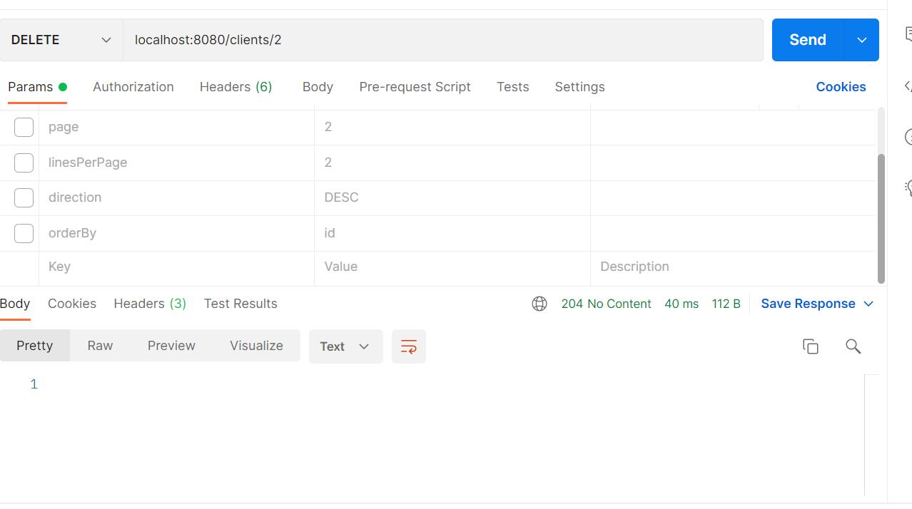

# Client Spring Project

 Projeto baseado na Classe Cliente com atribuidos de nome, id, data de nascimento, numeros de filhos e renda.
 
 Esse projeto esta estruturado em DTO, Entidades , Resources, Repositorie e Services.

 Utilizando localhost:8080/h2-console como meio de acesso a Banco H2.
 
### Consulta Get

 Podemos atraves desse projeto realiza as consultas por paginaçao utilizando a url base
 http://localhost:8080/clients
 Podemos ainda usar os atributos de paginação para controle do resultado obtido atraves da url
 localhost:8082/clients?page=2&linesPerPage=2&direction=DESC&orderBy=id
 usando os atributos page, linesPerPage, direction e orderBy Id.

 A consulta pode ser feito com o ID especifico usando a url base
 localhost:8080/clients/1

 Podemos ver as exceçoes sendo tratado a utilizar um ID nao presente como o ID 19.

### Utilizando o POST

Com a url base localhost:8082/clients, podemos inserir dados conforme o modelo JSON

{
"name": "Maria Silva",
"cpf": "12345678901",
"income": 6500.0,
"birthDate": "1994-07-20T10:30:00Z",
"children": 2
}

### Utilizando PUT

Nesse metodo do REST podemos alterar algum dados presente e caso nao existente temos os tratamentos de erro conforme observamos no GET
Temos a URL localhost:8082/clients/4 sendo 4 o numero do ID como meio de acessar o banco e manipular o dado.

### Utilizando o Delete

Seguindo a mesma URL do metodo PUT e inserindo o ID desejado temos a possibilidade deledar nosso objeto cadastrado em nosso banco de dados, havendo a confirmação com o numero 1

Caso o objeto deletado não exista temos a seguinte tratativa de srro.

{
"timestamp": "2021-11-25T21:45:55.490718900Z",
"status": 404,
"error": "Resource Not Found",
"message": "Id not Found 2",
"path": "/clients/2"
}

Informando a inexistencia do Objeto.

Para a consulta usamos o Postman, mas podemos manipular os dados via aplicações semelhante como Insomia.
Qualquer duvida me chamar elson1988